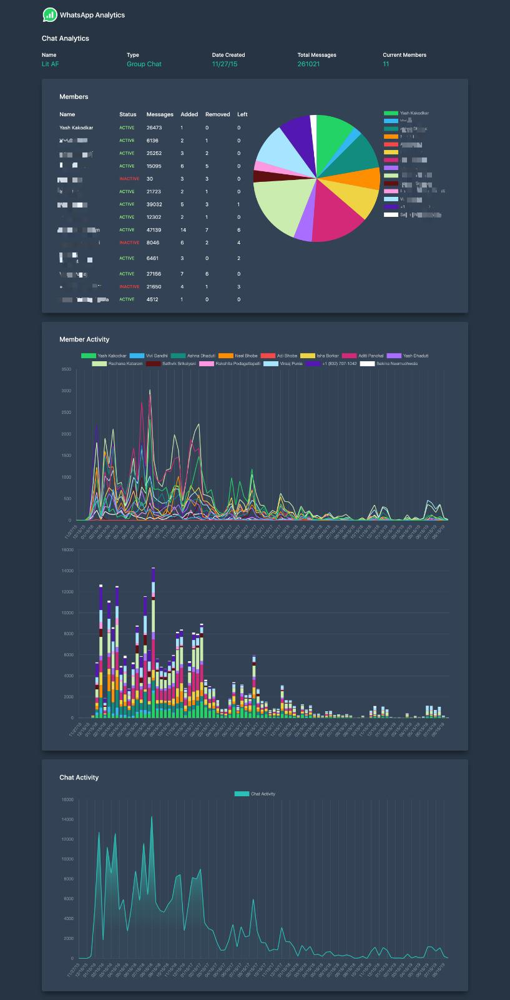

# Whatsapp-Analytics
This is a web project built using Python and Flask. Users can upload their Whatsapp chat transcript and 
obtain statistics such as messages sent over time, time a person was removed, message distribution per group member, etc.

